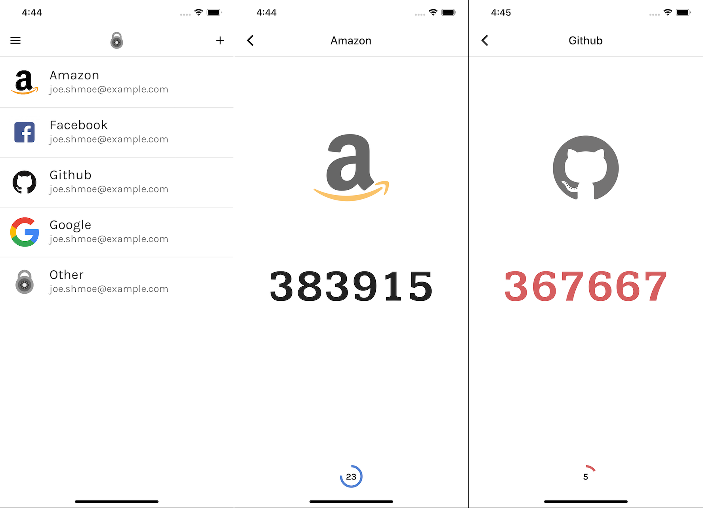

# Simple Authenticator

Simple Authenticator is a simple and minimalistic app for generating one-time codes (RFC 6238), which is used by many popular Internet services (Google, GitHub, Amazon, etc) as their manner of implementing two-factor verification.

